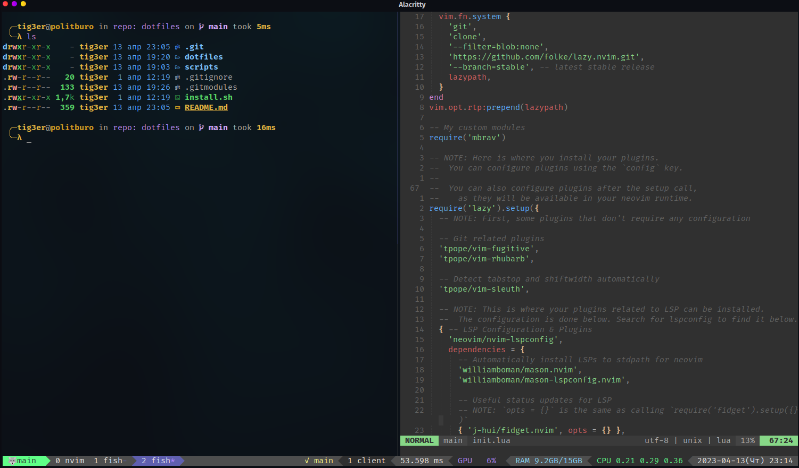

[](https://opensource.org/licenses/BSD-3-Clause)
[](https://tokei.rs/b1/github/mbrav/configs)

# configs (WIP)

My scripts and dot files



# Installation

⚠️ **Warning:** This will overwrite your configs!

Clone repo:

```bash
git clone --recurse-submodules -j8 https://github.com/mbrav/dotfiles
```

Copy dotfiles:

```bash
cp -r ./dotfiles/dotfiles/.*  ~/
```
