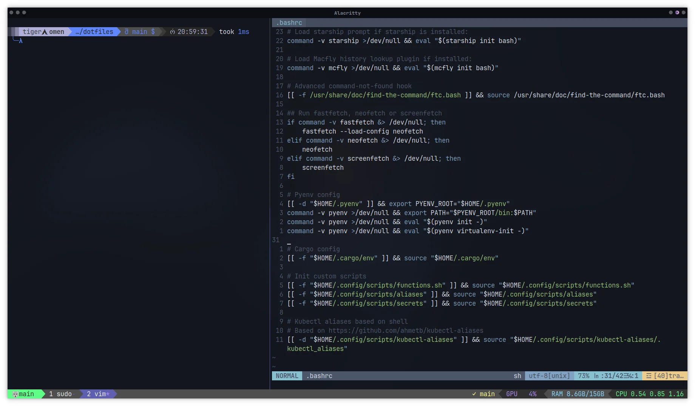

[](https://opensource.org/licenses/BSD-3-Clause)
[](https://tokei.rs/b1/github/mbrav/configs)
[](https://hitsofcode.com/github/mbrav/dotfiles/view?branch=main)

# dotfiles

My scripts and dot files

Consists of various DevOps-oriented configurations which are meant for my own personal Arch-based linux setup, but can be up based on other Linux distros such as Debian, Ubuntu, RHEL, etc.



## Overview

My config overall consists of dotfiles and [`scripts`](dotfiles/.config/scripts) that are meant to be `fish` and `bash` shell compatiable.
Since fish is not POSIX complaint, bash is meant to be used as a backup shell in cases where it would be more comfortable.
But the main advatnage of fish, in my use case, is that outocompletion is setup automaticaly for tools such as `docker`, `kubectl`, etc.

## Installation

To take the most advantage of the config, a few tools are used, which are recommended for installation since these are setup in [`aliases`](dotfiles/.config/scripts/aliases), [`.bashrc`](dotfiles/.bashrc) and [`config.fish`](dotfiles/.config/fish/config.fish):

- [Starship](https://starship.rs/) - A cross-shell prompt customizaion tool written in Rust;
- [McFly](https://github.com/cantino/mcfly) - A cross-shell tool for browsing through shell history;
- [fzf](https://github.com/junegunn/fzf) - A command-line fuzzy finder;
- [exa](https://github.com/ogham/exa) - A modern replacement for `ls`;
- [bat](https://github.com/sharkdp/bat) - A modern replacement for `cat`.

⚠️ **Warning:** This will overwrite your configs!

Clone repo:

```bash
git clone --recurse-submodules -j8 https://github.com/mbrav/dotfiles
```

Copy dotfiles:

```bash
cp -r ./dotfiles/dotfiles/.*  ~/
```
